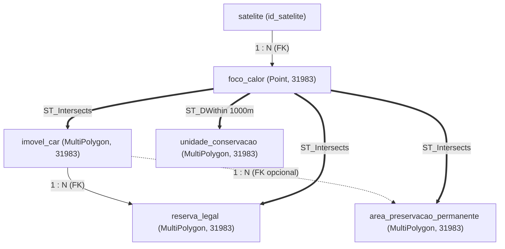
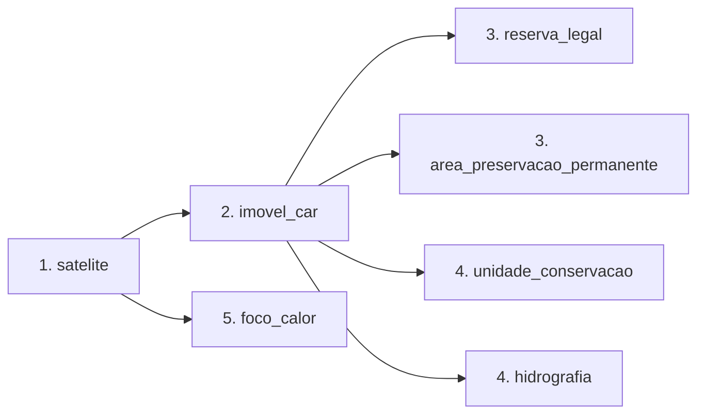

# Entrega 1: Fonte Transacional e Sistema de Origem

> Plataforma Corta-Fogo DF: ingestão transacional, modelagem relacional e espacial no PostgreSQL com PostGIS para cruzamento de ocorrências de calor e perímetros territoriais no Distrito Federal.

<!-- Change this to center and maximum horizontally, make it 3x bigger -->


<p style="text-align: center; font-size: 0.9em; color: #666;">Figura 1: Mapa vetorial do Distrito Federal, com limites municipais e regiões</p>

## 1. Visão Geral e Pergunta de Gestão

<p class="apresentador"><em>Apresentação: Gabriel Souza (Coordenação e Pergunta de Gestão)</em></p>

A modelagem responde à seguinte pergunta central de fiscalização ambiental:

> **Quais imóveis rurais do Distrito Federal tiveram focos de calor reincidentes em áreas de reserva legal, de preservação permanente ou a até 1 km de unidades de conservação entre 2015 e 2025?**

- **Atores interessados:** analistas de fiscalização ambiental e unidades de resposta a emergências do Distrito Federal (como o CBMDF).
- **Decisão apoiada:** priorização de imóveis rurais para vistorias em campo e ações preventivas de manejo do fogo antes do período de estiagem.
- **Estrutura da formulação:** define o sujeito cadastral (imóveis rurais do DF), o recorte geográfico (Distrito Federal), a série histórica completa de 11 anos (2015 a 2025) e critérios objetivos de sobreposição e proximidade a áreas protegidas, sem recorrer a siglas opacas.

## 2. Definições Operacionais da Consulta

<p class="apresentador"><em>Apresentação: Elias F. (Caracterização e Métricas)</em></p>

Cada termo da pergunta de gestão mapeia diretamente para regras relacionais e operadores espaciais no banco de dados:

| Conceito | Regra de negócio | Implementação no PostGIS |
| :--- | :--- | :--- |
| **Imóveis rurais do DF** | Polígonos de imóveis cadastrados no Cadastro Ambiental Rural (SICAR) para o DF. | Tabela `imovel_car` com chave primária `cod_imovel` (padrão `DF-%`) e carimbo `data_download`. |
| **Focos reincidentes** | Registros de calor do INPE dentro do DF em pelo menos 2 anos distintos. | Tabela `foco_calor`, contando anos distintos de `data_hora_evento` por imóvel (não o total de detecções). |
| **Reserva legal e Área de Prservação Permanente** | O foco intersecta área protegida declarada do imóvel ou mapeada no território. | Junção espacial (`ST_Intersects`) com `reserva_legal` e `area_preservacao_permanente` acelerada por GiST. |
| **Até 1 km de UCs** | O foco no imóvel está a no máximo 1.000 metros do limite de uma unidade de conservação. | Cálculo de distância métrica nativa (`ST_DWithin`) com `unidade_conservacao` no SRID 31983. |
| **Período de análise** | Anos completos entre 01/01/2015 e 31/12/2025. | Filtro temporal por intervalo em `data_hora_evento`. |
| **Sensores orbitais** | Todos os satélites entram no cálculo de reincidência. Séries comparáveis filtram o satélite de referência. | Coluna `id_satelite` com flag `is_referencia` (`AQUA_M-T`). |

## 3. Volumetria Real do Distrito Federal

<p class="apresentador"><em>Apresentação: Elias F. (Caracterização e Métricas)</em></p>

A carga foi dimensionada sobre a totalidade dos dados abertos do Distrito Federal:

| Camada / Tabela | Registros | Fonte pública | Tamanho aproximado |
| :--- | ---: | :--- | :--- |
| `foco_calor` | 38.945 | BDQueimadas (INPE), 2015 a 2025 | 4,5 MB (CSVs consolidados) |
| `imovel_car` | 21.047 | SICAR / Ministério da Agricultura | 21 MB compactado |
| `reserva_legal` | 13.499 | SICAR / Ministério da Agricultura | 10 MB compactado |
| `area_preservacao_permanente` | 2.234 | IBRAM / SISDIA | 8 MB |
| `unidade_conservacao` | 84 | IBRAM / SISDIA | 2 MB |

Detalhamento dos focos de calor no Distrito Federal:

- Total com todos os satélites: 38.945 registros de 20 sensores distintos (mínimo de 948 focos em 2018 e máximo de 6.190 em 2024).
- Total com o satélite de referência (`AQUA_M-T`): 2.350 registros no mesmo período (fator de redução de 16,5 vezes).

## 4. [Decisão Técnica de Arquitetura 0001](../../adr/01-adotar-postgresql-com-postgis-camada-gold.md)

<p class="apresentador"><em>Apresentação: João V. Farias (ADR)</em></p>

Síntese das seis seções da decisão de arquitetura para a escolha do banco de dados principal:

- **Contexto:** cruzamento de 39 mil focos contra 21 mil imóveis do CAR e reservas com até 54 mil. Exige projeção métrica (SIRGAS 2000 / UTM zone 23S, EPSG:31983) e validação topológica (`ST_IsValid`).
- **Alternativas:** avaliação de três caminhos técnicos: PostgreSQL puro (sem índice R-tree para ponto em polígono), MongoDB (limitado a coordenadas esféricas WGS84 e sem operador eficiente de junção espacial) e PostgreSQL com PostGIS.
- **Medição:** benchmark mínimo e reproduzível ([`scripts/benchmark/`](https://github.com/BeyondMagic/corta-fogo-df/tree/main/scripts/benchmark)) com o dado real do DF: a mesma consulta sem índice espacial estoura 5 minutos (timeout, não termina), com índice GiST responde em 41,8 s. MongoDB não foi implementado nem medido; justificativa técnica no ADR.
- **Decisão:** adoção do PostgreSQL 16 com PostGIS 3.4, SRID 31983 fixo, restrição `CHECK (ST_IsValid(geom) AND NOT ST_IsEmpty(geom))` e índices GiST em todas as geometrias.
- **Consequências:** ganho de operadores espaciais nativos (`ST_Intersects`, `ST_DWithin` em metros) e integridade referencial com a tabela `satelite`; custo de dependência de binários compilados e reprojeção de dados na ingestão.
- **Gatilho de revisão:** migração do processamento analítico para DuckDB com GeoParquet caso as consultas permaneçam acima de 5 s após simplificação topológica (`ST_SimplifyPreserveTopology`).

## 5. Esquema Espacial e Relacional (PostGIS)

<p class="apresentador"><em>Apresentação: Manoel Felipe (Modelagem de Dados)</em></p>

### Padrão de Projeção Espacial (SRID 31983)

Todas as colunas geométricas utilizam a projeção métrica **EPSG:31983** (SIRGAS 2000 / UTM zone 23S):

- **Justificativa geográfica:** o território do Distrito Federal está situado integralmente no fuso UTM 23S.
- **Eficiência computacional:** coordenadas métricas planas permitem calcular distâncias e buffers (como a faixa de 1.000 metros via `ST_DWithin`) sem conversão computacional para o tipo `geography`.
- **Validação de esquema:** nenhuma coluna pode ser definida como tipo genérico `geometry` sem SRID declarado.

Conversão métrica na ingestão de detecções em WGS84 (EPSG:4326):

```sql
ST_Transform(
  ST_SetSRID(ST_MakePoint(longitude, latitude), 4326),
  31983
)
```

### Modelo Lógico e Relacionamentos

A estrutura conjuga integridade relacional clássica (chaves estrangeiras) com relacionamentos espaciais dinâmicos:



- **Relações relacionais:** chaves estrangeiras formais vinculam cada foco de calor ao sensor em `satelite`, e cada polígono de reserva legal ao cadastro em `imovel_car`.
- **Relações espaciais:** o vínculo entre ocorrências de calor e os perímetros territoriais é avaliado no momento da consulta por predicados topológicos (`ST_Intersects` e `ST_DWithin`), sem colunas de chave fixa nas ocorrências pontuais.

### Especificação das Tabelas

O DDL das tabelas físicas é gerenciado por migrações versionadas do Flyway (diretório `migrations/`):

| Tabela | Tipo geométrico | Chave primária | Restrições de integridade e regras |
| :--- | :--- | :--- | :--- |
| `satelite` | Sem geometria | `id_satelite` | Nome único; no máximo um registro com flag `is_referencia = TRUE`. |
| `imovel_car` | `MultiPolygon, 31983` | `cod_imovel` | Formato padrão `DF-%`; restrição `CHECK (ST_IsValid(geom) AND NOT ST_IsEmpty(geom))`; metadado `data_download`. |
| `reserva_legal` | `MultiPolygon, 31983` | `id_reserva` | Chave estrangeira `cod_imovel` referenciando `imovel_car` (`ON DELETE CASCADE`); restrição `ST_IsValid`. |
| `area_preservacao_permanente` | `MultiPolygon, 31983` | `id_app` | Chave estrangeira opcional para `imovel_car`; restrição `ST_IsValid`. |
| `unidade_conservacao` | `MultiPolygon, 31983` | `id_uc` | Restrição `CHECK (ST_IsValid(geom) AND NOT ST_IsEmpty(geom))`; metadado `data_download`. |
| `foco_calor` | `Point, 31983` | `id_foco` | Chave estrangeira para `satelite`; constraint `data_hora_ingestao >= data_hora_evento`; trigger de imutabilidade. |
| `hidrografia` | `MultiLineString, 31983` | `id_trecho` | Tabela auxiliar na E1; restrição `ST_IsValid`. |

### Estratégia de Indexação

1. **Índices GiST (R-Tree):** aplicados em todas as colunas `geom` das tabelas espaciais. Reduzem a complexidade do teste de sobreposição de $O(N \times M)$ para varredura de caixas mínimas envolventes indexadas.
2. **Índices B-tree relacionais:**
   - `foco_calor(data_hora_evento)` para filtros no intervalo de 2015 a 2025.
   - `foco_calor(id_satelite)` para consultas filtrando satélite de referência.
   - `reserva_legal(cod_imovel)` para junções diretas com o imóvel rural.
   - Índice parcial único em `satelite(is_referencia)` onde `is_referencia = TRUE`.

## 6. Mapeamento da Consulta da Pergunta de Gestão

<p class="apresentador"><em>Apresentação: Manoel Felipe (Modelagem de Dados)</em></p>

A consulta central é avaliada em quatro etapas espaciais e temporais:

1. **Recorte temporal:** `f.data_hora_evento BETWEEN '2015-01-01' AND '2025-12-31'`.
2. **Interseção com o imóvel rural:** `ST_Intersects(f.geom, i.geom)`.
3. **Critérios de proximidade ou sobreposição ambiental (cláusula OR):**
   - Foco intersecta reserva legal do mesmo imóvel: `ST_Intersects(f.geom, r.geom) AND r.cod_imovel = i.cod_imovel`.
   - Foco intersecta área de preservação permanente: `ST_Intersects(f.geom, a.geom)`.
   - Foco está no raio de 1 km de uma unidade de conservação: `ST_DWithin(f.geom, u.geom, 1000)`.
4. **Agrupamento e reincidência:** `COUNT(DISTINCT date_part('year', f.data_hora_evento)) >= 2` agrupado por `i.cod_imovel`.

## 7. Ingestão e Histórico dos Focos de Calor

<p class="apresentador"><em>Apresentação: João V. Farias (Ingestão de Focos)</em></p>

Os focos de calor do BDQueimadas (INPE) registram ocorrências físicas consumadas no tempo e no espaço. Por representarem fatos reais já detectados por satélites, esses dados exigem tratamento imutável no banco de dados.

### Focos de Calor: Semântica Imutável (Insert-Only)

Os registros de calor não sofrem alterações após a detecção orbital:

1. **Operações permitidas:** a tabela `foco_calor` aceita apenas comandos `INSERT`. Comandos `UPDATE` e `DELETE` são bloqueados pelo trigger `tg_foco_calor_imutavel`.
2. **Modelo bitemporal:**
   - `data_hora_evento`: carimbo temporal registrado pelo satélite na passagem orbital. É o valor usado para agrupar anos distintos na contagem de reincidência.
   - `data_hora_ingestao`: carimbo registrado pelo pipeline na inserção no PostgreSQL, para auditoria e controle de recargas.
3. **Múltiplos sensores orbitais:** um mesmo incêndio pode gerar detecções por satélites distintos ou em passagens contíguas. A ingestão preserva todas as ocorrências individuais sem deduplicação artificial. A contagem agrupa anos distintos de `data_hora_evento` por imóvel. Análises históricas comparáveis filtram o satélite de referência (`AQUA_M-T` via flag `is_referencia`).

## 8. Cadastros Territoriais e Snapshots

<p class="apresentador"><em>Apresentação: Gabriel Fernando (Ingestão de Camadas)</em></p>

Imóveis rurais e áreas protegidas têm natureza cadastral e regulatória. Limites fundiários no SICAR e perímetros declarados pelo IBRAM/SISDIA passam por retificações administrativas periódicas.

### Cadastros Territoriais: Snapshot com Rastreabilidade

A Entrega 1 adota uma estratégia de corte estático oficial:

1. **Recorte consolidado:** a base carrega o conjunto oficial de feições do SICAR e do IBRAM para o Distrito Federal.
2. **Rastreabilidade por data de extração:** as tabelas `imovel_car`, `reserva_legal`, `area_preservacao_permanente` e `unidade_conservacao` contêm a coluna obrigatória `data_download`, que registra a data de extração dos arquivos oficiais.
3. **Escopo analítico:** as consultas respondem se o foco atingiu o imóvel ou a zona de amortecimento segundo a delimitação territorial vigente no snapshot carregado.

### Ingestão e Saneamento das Camadas

O pipeline de camadas baixa e descompacta os arquivos do SICAR e do SISDIA, converte todas as geometrias para o SRID 31983 e corrige autointerseções antes da carga. Esse processo assegura que cada polígono atenda à restrição `CHECK (ST_IsValid(geom) AND NOT ST_IsEmpty(geom))` definida no esquema físico.

### Resumo da Capacidade Analítica Atual

| Tabela | Padrão temporal | O que o banco garante | O que a consulta responde |
| :--- | :--- | :--- | :--- |
| `foco_calor` | Imutável (*insert-only*) | Histórico preservado sem sobrescrita; distinção entre evento e ingestão. | Focos reais detectados no intervalo de 2015 a 2025. |
| `imovel_car` | *Snapshot* com `data_download` | Delimitação territorial cadastrada com data de extração auditável. | Localização do foco dentro do perímetro registrado do imóvel. |
| `reserva_legal` | *Snapshot* com `data_download` | Geometria da reserva associada ao imóvel na data de extração. | Ocorrência de fogo dentro da reserva legal do snapshot oficial. |
| `area_preservacao_permanente` | *Snapshot* com `data_download` | Mapeamento territorial de preservação permanente no DF. | Fogo em área protegida conforme a base distrital do IBRAM. |
| `unidade_conservacao` | *Snapshot* com `data_download` | Perímetro oficial das UCs distritais e federais no DF. | Fogo na faixa de amortecimento de 1.000 m do limite protegido. |

<!-- ### Evolução Futura: Versionamento com SCD Tipo 2

A Entrega 1 não implementa tabelas de dimensão de variação lenta (SCD Tipo 2) para preservar a estabilidade da carga transacional. Caso análises de entregas futuras demandem saber se a área estava formalmente averbada na data exata da detecção, a modelagem prevê a adição de colunas temporais de vigência (`vigencia_inicio` e `vigencia_fim`) com cruzamento por intervalo semiaberto. -->

## 9. Ordem de Carga e Dependências

<p class="apresentador"><em>Apresentação: Samuel Rodrigues (Migrações)</em></p>

Para preservar a integridade referencial das chaves estrangeiras, a carga de dados obedece à ordem determinística:



Sequência de ingestão:

1. `satelite`: cadastro das fontes com definição do sensor de referência `AQUA_M-T`.
2. `imovel_car`: malha fundiária dos imóveis rurais do DF.
3. `reserva_legal` e `area_preservacao_permanente`: dependem dos códigos de imóveis cadastrados.
4. `unidade_conservacao` e `hidrografia`: camadas de referência distrital sem dependência cadastral.
5. `foco_calor`: tabela de eventos que referencia a tabela `satelite`.

## 10. Como Reproduzir a Carga

<p class="apresentador"><em>Apresentação: Cláudio Henrique (Infraestrutura)</em></p>

A inicialização e a carga completa do banco ocorrem com um único comando na raiz do repositório:

```bash
docker compose up
```

Fluxo automatizado da execução:

1. Inicia o contêiner PostgreSQL 16 com extensão PostGIS 3.4.
2. O Flyway aplica as migrações SQL em ordem (`V1__...` a `V5__...`).
3. Os serviços de ingestão disparam em paralelo a carga de focos do INPE e das camadas territoriais.
4. As rotinas garantem idempotência e saneamento topológico de polígonos inválidos.

## 11. Artefatos e Entregáveis

<p class="apresentador"><em>Apresentação: Gabriel Souza (Coordenação e Pergunta de Gestão)</em></p>

Documentos complementares e código-fonte versionados no repositório:

- **[Decisão de Arquitetura (ADR 0001)](../../adr/01-adotar-postgresql-com-postgis-camada-gold.md):** justificativa da escolha do PostgreSQL com PostGIS, análise de três alternativas e benchmarks com dados do DF.
- **[Glossário Técnico](../../glossario.md):** definições formais e referências bibliográficas de conceitos espaciais, temporais e de engenharia de dados.
- **[Scripts de Migração](https://github.com/BeyondMagic/corta-fogo-df/tree/main/migrations):** scripts SQL versionados gerenciados pelo Flyway.
- **[Pipelines de Ingestão](https://github.com/BeyondMagic/corta-fogo-df/tree/main/src/pipeline):** extração do INPE e saneamento topológico com GeoPandas e GDAL.


## 12. Referências

Fontes de dados, especificações e normas técnicas utilizadas na elaboração da Entrega 1:

### Fontes de Dados Públicas

1. **INPE (Instituto Nacional de Pesquisas Espaciais):** Programa Queimadas. Banco de Dados de Queimadas (BDQueimadas). Detecções de focos de calor por sensores orbitais (2015 a 2025). Disponível em: <https://queimadas.dgi.inpe.br/queimadas/bdqueimadas>.
2. **SICAR (Sistema Nacional de Cadastro Ambiental Rural):** Ministério da Agricultura e Pecuária / Serviço Florestal Brasileiro. Base geográfica de imóveis rurais e reservas legais do Distrito Federal. Disponível em: <https://www.car.gov.br/>.
3. **SISDIA (Sistema Distrital de Informações Ambientais):** Instituto Brasília Ambiental (IBRAM). Mapeamento oficial de Unidades de Conservação e Áreas de Preservação Permanente (APP) do Distrito Federal. Disponível em: <https://sisdia.df.gov.br/>.

### Normas e Padrões Espaciais

4. **OGC (Open Geospatial Consortium):** *OpenGIS Implementation Standard for Geographic information - Simple feature access - Part 1: Common architecture (OGC 06-103r4)*, 2011.
5. **EPSG Geodetic Parameter Dataset:** *Coordinate Reference System EPSG:31983 (SIRGAS 2000 / UTM zone 23S)*. International Association of Oil & Gas Producers (IOGP). Disponível em: <https://epsg.io/31983>.
6. **Legislação Ambiental e Cartográfica:**
   - Lei Federal nº 12.651, de 25 de maio de 2012 (Código Florestal brasileiro).
   - Lei Federal nº 9.985, de 18 de julho de 2000 (Sistema Nacional de Unidades de Conservação - SNUC).
   - Decreto Federal nº 5.334, de 6 de janeiro de 2005 (adoção do SIRGAS 2000 no Sistema Geodésico Brasileiro).

### Tecnologias e Metodologia

7. **PostGIS Project:** *PostGIS 3.4 Spatial Database Guide*. Refractions Research e PostGIS Steering Committee. Disponível em: <https://postgis.net/docs/>.
8. **Nygard, Michael:** *Documenting Architecture Decisions*, 2011. Metodologia adotada no [ADR 0001](../../adr/01-adotar-postgresql-com-postgis-camada-gold.md).
9. **Corta-Fogo DF:** [Glossário Técnico e Conceitual](../../glossario.md), com referências detalhadas sobre modelagem bitemporal, índices GiST e estruturas vetoriais.
